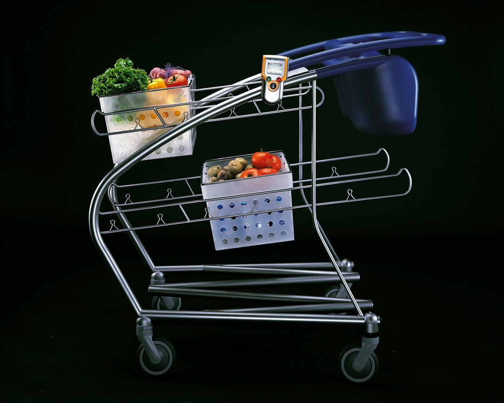

## Reading Assignment 1: The Deep Dive
[The Deep Dive](https://www.youtube.com/watch?v=2Dtrkrz0yoU)

**This video is about 20 years old! Which ideas from this work show up in today's shopping carts? Which ideas did not make it, and why didn't they?**
1. Hand held scanners are indeed found in many stores but only for price checks, and there is self-checkout option. Allowing scanners for full checkout is not implemented to avoid theft.
2. Although you cannot pile baskets on todays shopping carts, there is still some modularity where you see separate baskets on top of each other. They cannot be removed from the cart though.I think the reason why the modular baskets approach wasn't implemented is because shoppers are too comfortable dumping everything in the cart rather than handling four separate baskets during checkout.
3. The child seat didn't make it probably because it doesn't looks secure enough to hold the child in place. Although shopping carts today have catered to child safety by adding straps.
4. Walkie-talkie to talk to the staff is probably overdoing it, and this could be a real nightmare for the staff and this devie could be misused easily.
5. The steerable back-wheels have been implemented because they allow for easy maneuvering of carts.

**Who did the design team talk to? For each group of stakeholders that the designers talked to, explain why it was important to talk to them.**

The design team talked to the product experts i.e people who make, use and repair these carts. The stakeholders in this case were the shoppers, maintainers and staff. It was important to talk to them because those people deal with the carts on an everyday basis and it is faster than learning about the product by yourself. For example the shop staff complained that these carts get carried away by wind easily . A customer complained about child safety and suggested that the seat needs to be redesigned. It was a good social science experiment to determine what problems they face and how can they learn from it to design a better cart.
