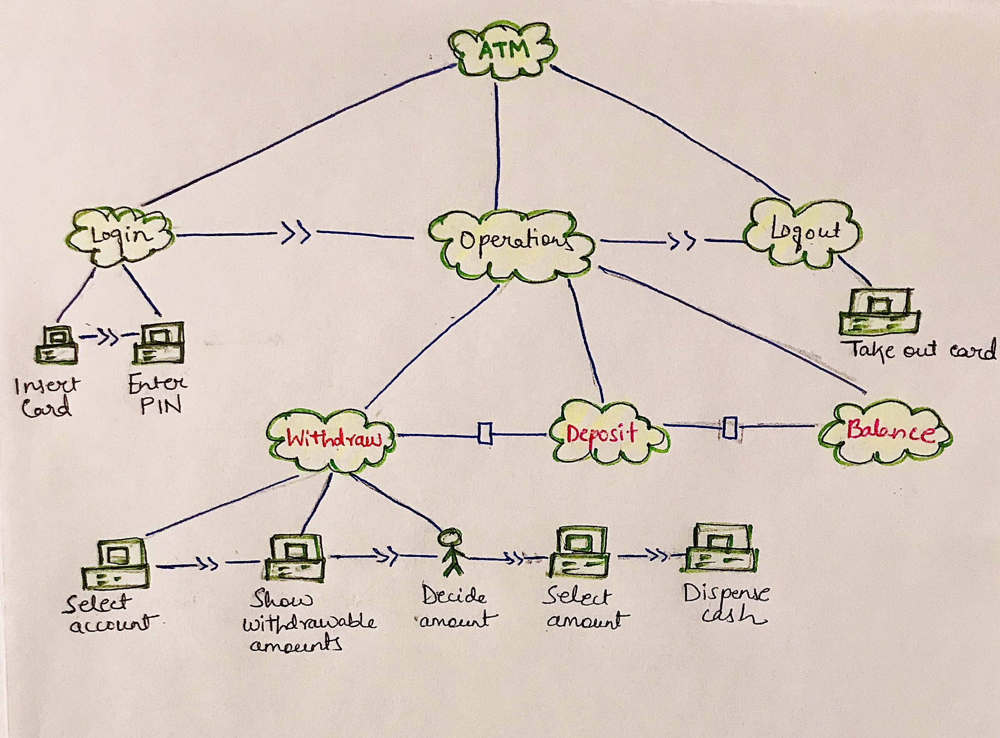

## Reading Assignment 2: Users and Tasks

**Personas**

According to Alan Cooper’s [book](https://www.oreilly.com/library/view/inmates-are-running/0672326140/?ar), a persona is shown as a specific person but is not a real individual. It kind of represents a significant portion of the people in the real world and helps designers to to design for a specific person, rather than a generic group. Personas are a core component of goal-directed design. They don’t represent the users, but rather the users’ goals. This chapter helped me understand the user considerations while designing and the importance of them in interaction design. Here are some main takeaways and questions I got out of this chapter:

- Personas should prevent us from designing for _elastic users_. If I don’t have a specific person in mind, I’ll try to design features that _somebody_ will like. Very soon, the user is someone that bends and stretches according to my design. As a result, I end up with a design which is too broad, trying to please all viewpoints from all kinds of users.

**Task Model**

This is the task model for my project ATM Simulator app, which I had developed in the spring semester for the course Object Oriented Design and Analysis. I've only elaborated the tasks for the withdraw operation here:

