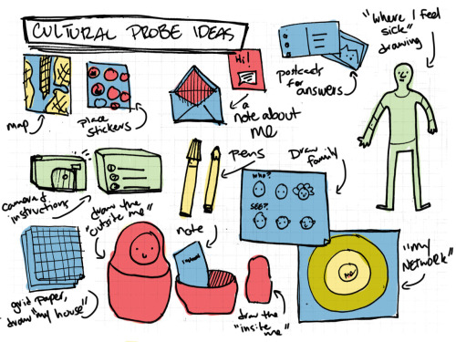

## Reading Assignment 2: Formative Research

I chose to read these two articles for this assignment:

[Design: Cultural Probes](https://dl.acm.org/citation.cfm?id=291235)

[Urban Probes: Encountering our emergent urban atmospheres](https://dl.acm.org/citation.cfm?id=1055020)

The first article because it immediately reminded me of the cultural issues I faced while working in Japan. We were designing a new system for the sales people of our company, and our team (all foreigners) ran into a number of issues trying to survey these Japanese salesmen about their concerns with the existing system they were using. It was difficult to gain a true understanding of their culture, behavior and attitudes, and more difficult to dig deeper to find out their preferences, and concerns. Our UX research team tried out various questionnaires and surveys, but they could not elicit much useful responses, mostly because their group was unfamiliar to the designers.

[Image Source](https://speckledwords.tumblr.com/post/31779016690/thinking-of-what-to-include-in-my-cultural-probe)

The authors in this article talk about cultural probes as a collection of tools, artifacts and tasks that are intended to provoke the user to look and think about their environment differently. In the Presence Project, they used an assortment of maps, postcards, cameras and booklets as "gifts" to provoke inspirational responses from the elderly people. The authors wanted to understand the local culture, so that their designs don not seem irrelevant. Responses from these "probes" can initiate a useful conversation between the designers and the participants. And with minimal intrusion, designers can peek into the group's environment and uncover new ideas.

Now obviously, a key thing to keep in mind is how to design these cultural kits, as the designers must pick materials and activities that are relevant to their goals. These kits should be playful, yet should be taken seriously. I think cultural probes can be really useful, when you are designing something for differently-abled people, or for people living in sensitive environments, such as psychiatric patients. 

The second article is just an extension of using probes in an urban space.

_How can technology embedded within the city’s infrastructure facilitate and provoke story telling?_

Intel's Urban Probes research throws light on deconstructing urban situations, and revealing new opportunities for technology in urban spaces. The researches developed an augmented trashcan which exposes city dwellers to the pattern of trash interactions. Urban probes allow a way to empower city dwellers to participate in the construction of their newly emerging digital city landscape. Although personally, I find the end artefact a little useless, it is not difficult to see, I agree with the big picture it is trying to portray: urban probes providing a glimpse into people's daily urban street life. We can definitely use urban probes to gather information about how users use technology in a real world setting.
