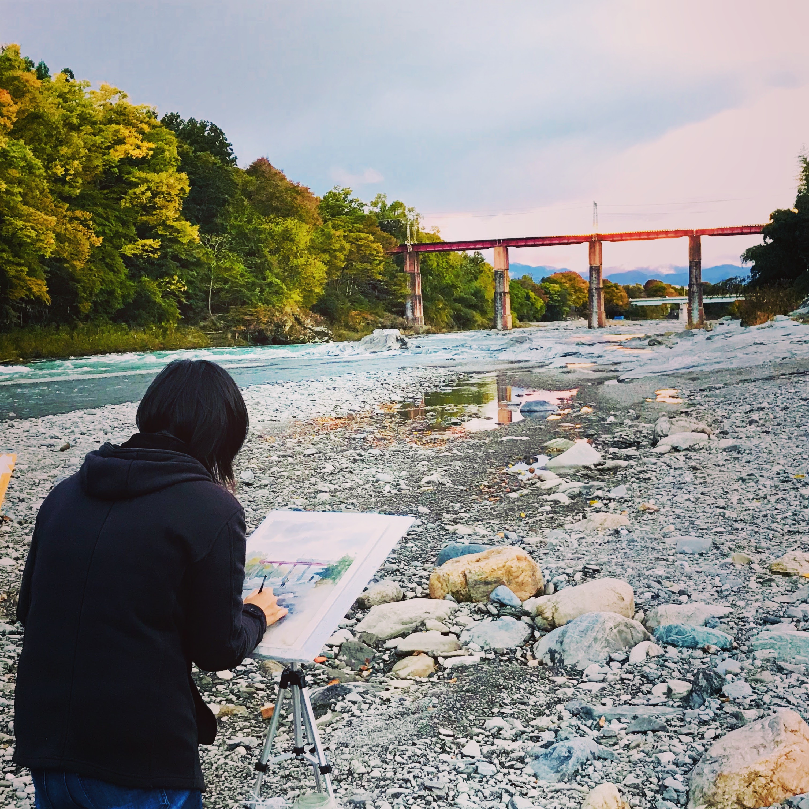

   
Sharon Parker

She, Her | 27 | UT Austin graduate | New Yorker staff writer | Blogging, Painting

She is a huge travel enthusiast. She has traveled to 22 countries so far!
Spends her free time mostly blogging, painting and reading about different places around the world. She also loves sending postcards to her friends and family from each place she visits. She likes to peruse potential vacation destinations, and the way she goes about it is by spending way too much time on the internet looking for photos. She also uses Google Earth/Maps street view at times to virtually explore these places. For instance, if she gets a craving for oceanside views and crystal waters, she’d spin the globe, pick up Santorini in Greece, zoom in and just take a look around. Sometimes she’d explore cities like Tokyo and be in awe with the design of the roads and the busy crossings.

   
Emily Wang

She, Her | 22 years old | UCLA | Game designer at Ubisoft | Gaming, Movies, Swimming

Emily is a CS undergrad in UCLA. Currently, she is interning with Ubisoft on their new South Park video game. She has grown up watching movies from all different genres and decades. Some of her favorites are - Seven Samurai,  The Matrix. She has a particularly deep in interest in cinematography and filmmaking. She is also a huge fan of animated movies and shows. Besides watching movies, she also spends a lot of time playing Minecraft. 
