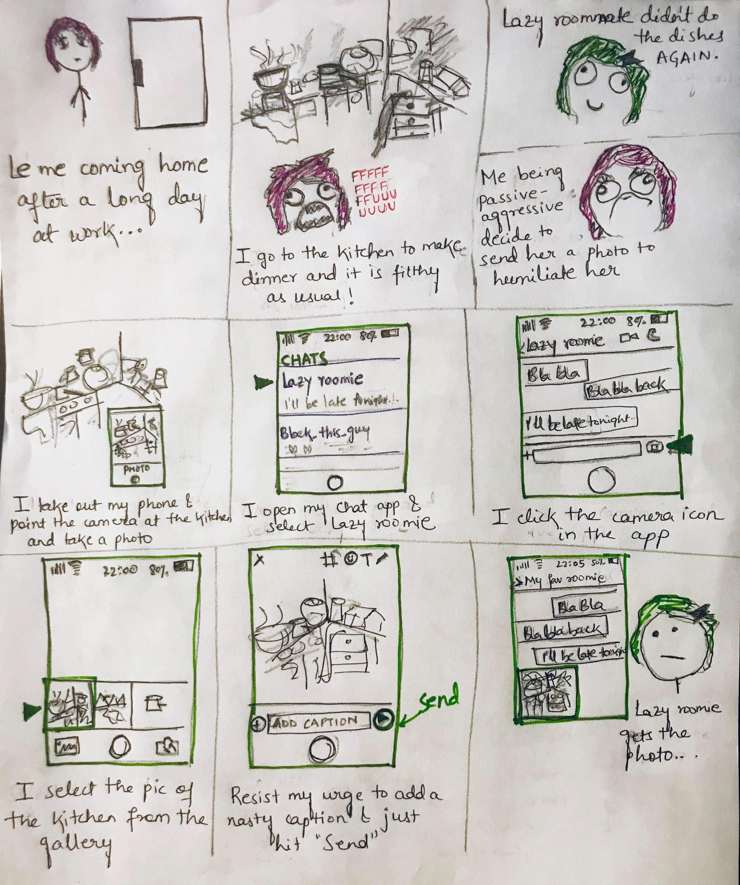

It's time to show-off my terrible sketching skills!
Here's the task: create a one-page storyboard sketching out the workflow for how you would send a photo to a contact on your mobile phone (as it works currently; do not invent a new interface for this activity)

This is what I came up with:

 
