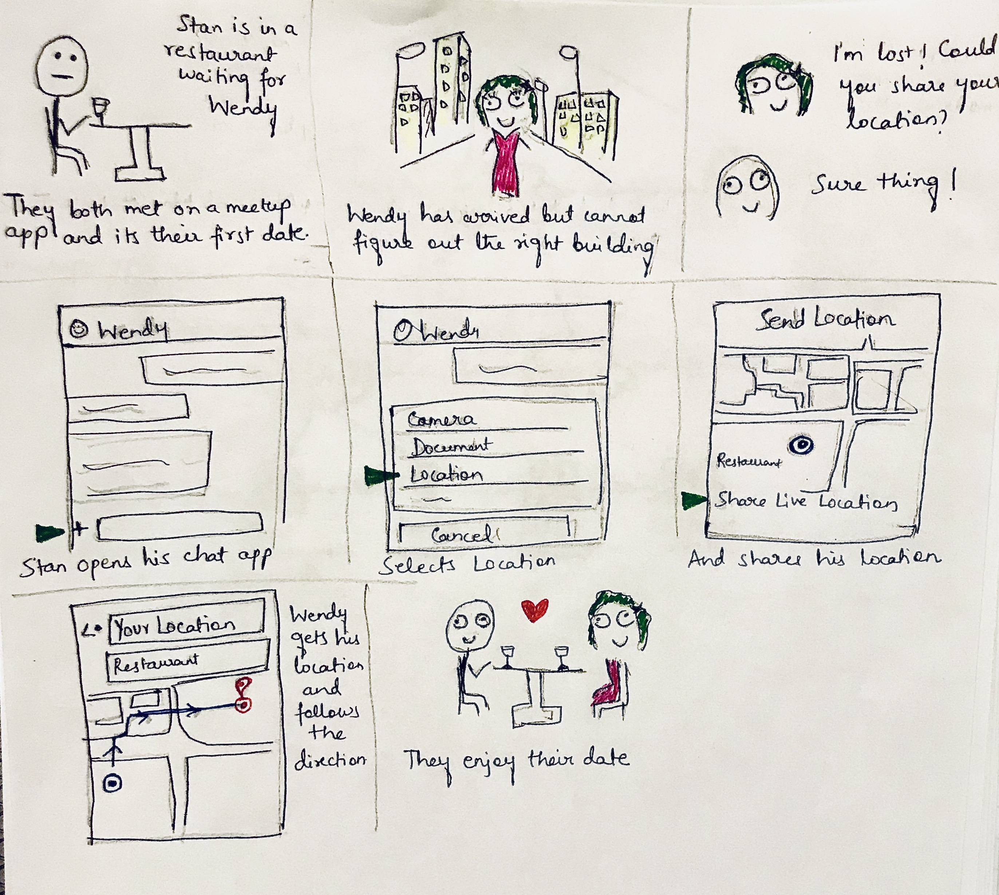

It's time to show-off my terrible sketching skills!

First task: Create a one-page storyboard sketching out the workflow for how you would send a photo to a contact on your mobile phone (as it works currently; do not invent a new interface for this activity)

 

Second task: Sketch location sharing for a meetup app

 

Third task: Sketch coding UI for Apple TV. Design an interface for coding using the Apple TV remote.
These are the main features I've come up with:
1. The touch area will lit up with a keyboard interface, and the user can swipe type to form words.

2. The code editor will have autocomplete feature which will detect when the user is sliding through the characters.

3. There is a toggle button to switch between editor mode and normal mode, when the user wants to scroll, go to a specific line, etc.

4. There is a button to save and run the program.

5. There is a button to choose language, so the editor can use autocomplete accordingly.

6. There is another small touch interface at the bottom to help slide across a statement.

 