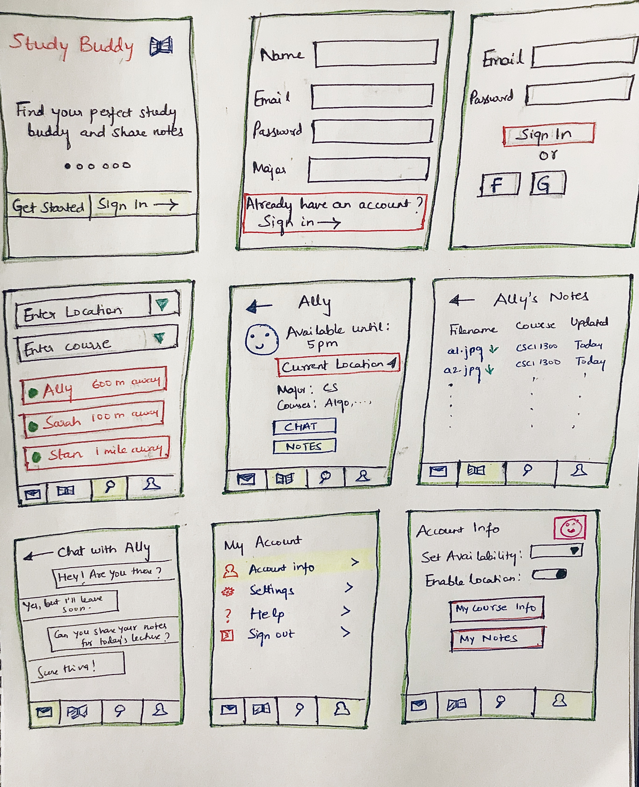

## Reading Assignment 6: Prototyping

I read the following two papers to gain more insight on prototyping techniques:

[Beaudouin-Lafon and MacKay’s chapter on Prototyping Tools and TechniquesPreview the document from the HCI Handbook](https://canvas.colorado.edu/courses/56035/files/8228649/download?wrap=1)

[Li et al’s Topiary](https://kilthub.cmu.edu/articles/Topiary_A_Tool_for_Prototyping_Location-Enhanced_Applications/6470561/files/11899118.pdf)

We plan to use a combination of horizontal prototypes, beginning with rapid prototyping and progressing to non interactive simulations. 

For our course project, task-oriented prototype would be ideal as it would mirror the set of exact tasks the user would want to accomplish within the system. They combine the breadth of horizontal prototypes, to cover the functions required by those tasks, with the depth of vertical prototypes, enabling detailed analysis of how the tasks can be supported.

Before spending a great deal of time in developing prototypes, we can do some rapid prototyping. Simple offline prototyping techniques like paper and pencil work well for any system and is the fastest way to get a quick idea of the system. 

I found the Wizard of Oz technique really interesting as it gives the illusion of a working system to the user, and the designers can note how the user is interacting with the user.

Going forward after few iterations, we can use some online prototyping techniques like the non-interactive simulation using a widely used tool. Interfaces can also be prototyped quickly with this approach, by drawing different states of the system in different cards and using buttons to switch from one card to the next.

Task: Create a paper prototype for a study buddy app

